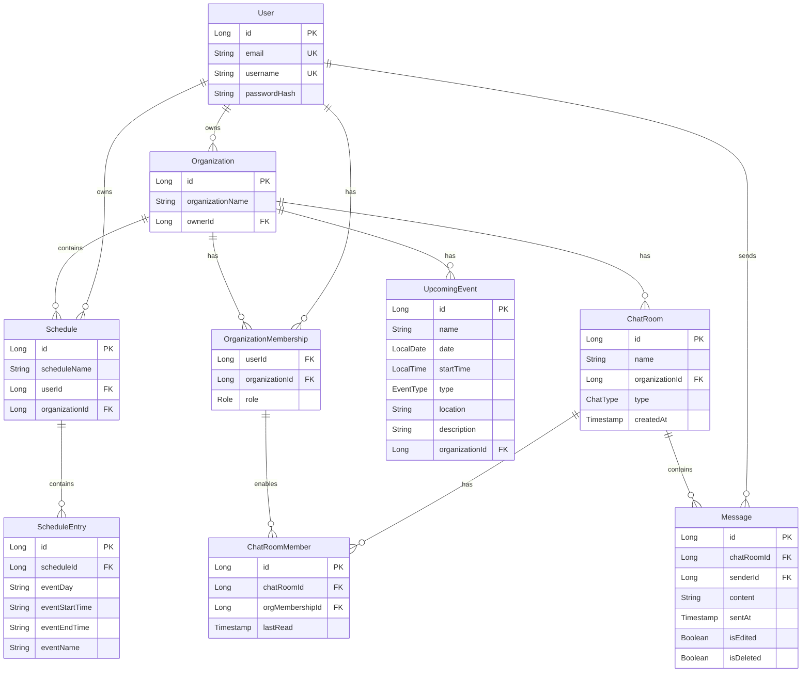

# Planly

Planly is a sophisticated web application engineered to streamline schedule coordination and event management within organizations. The platform serves as a centralized hub where organization members can share their availability, plan events, and manage group activities efficiently. Planly simplifies the complexity of group coordination with features like availability visualization and real-time schedule management.

## 🌟 Core Features

### Organization Management
- Create and manage organizations with role-based permissions
- Join existing organizations through invitation or search
- View organization member directories and manage memberships
- Organization-specific dashboards with activity overview
- Member availability heatmap showing overlapping free times


### Event Management
- Create and manage organization events with detailed information
- Event calendar with different view options
- Event categorization and type management
- Upcoming events dashboard for quick overview
<p>

</p>
<p>

</p>

### Schedule Management
- Create and edit personal schedules with customizable time slots
- Visual schedule comparison across organization members
- Schedule entries exportable for external use *(Coming soon)*


### User Experience
- Responsive design supporting desktop and mobile views
- Real-time notifications and toasts for user feedback
- Intuitive navigation with sidebar menu
- Dark/light theme support *(Coming soon)*


### Security Features
- CORS configuration for secure cross-origin requests
- CSRF protection
- Secure password handling
- JWT token validation and refresh
- Session management
- Protected API endpoints

## 🔧 Technical Implementation

### Backend Architecture
- **Framework**: Spring Boot with Java 21
- **API Design**: RESTful architecture with standardized endpoints
- **Security**: 
  - JWT-based authentication
  - Role-based access control (RBAC)
  - Spring Security integration
  - Password encryption using BCrypt
- **Database**: 
  - H2 Database for development
  - JPA/Hibernate for ORM
  - Structured entity relationships
  - Optimized queries for performance
#### Database Structure:


### Frontend Architecture
- **Framework**: React with modern hooks and functional components
- **State Management**: React hooks for local state management
- **UI Components**:
  - Custom modals for user interactions
  - Responsive sidebar navigation
  - Dynamic form handling
  - Toast notifications system
- **Styling**: 
  - Tailwind CSS for utility-first styling
  - Responsive design patterns
  - Lucide icons for consistent iconography

### API Endpoints

#### Authentication
- POST `/api/auth/sessions`: User login with JWT token response
- POST `/api/auth/users`: New user registration
- GET `/api/auth/validate`: Validate the current session
- POST `/logout`: Clear the JWT cookie

#### Organizations
- POST `/api/organizations/new`: Create new organization
- POST `/api/organizations/{orgId}/members`: Join an organization
- POST `/api/organizations/{orgId}/events`: Add a new event to an organization
- DELETE `/api/organizations/{orgId}/members`: Remove organization member
- GET `/api/organizations/owned/id-name`: Get IDs and names of owned organizations
- GET `/api/organizations/{orgName}`: Search for organizations by name
- GET `/api/organizations/{orgId}/events`: Get upcoming events
- GET `/api/organizations/{orgId}/details`: Get organization details
- GET `/api/organizations/{orgId}/members`: Get organization members

#### Chat
- GET `/api/chat/rooms/organization/{orgId}`: Get an organization's chat rooms
- POST `/api/chat/rooms`: Create a new chat room with chosen members
- DELETE `/api/chat/rooms`: Delete a chat room
- GET `/api/chat/rooms/{roomId}/messages`: Get all messages from a chat room
- POST `/api/chat/rooms/{roomId}/messages`: Send a message to the chat room
- POST `/api/chat/rooms/{roomId}/members`: Add members to a chat room
- DELETE `/api/chat/rooms/{roomId}/members`: Remove a member from a chat room
- POST `/api/chat/rooms/{roomId}/mark-read`: Mark chats as "read"
- GET `/api/chat/rooms/{roomId}/unread-count`: Get the number of unread messages

#### Schedules
- POST `/api/schedules`: Create new schedule
- PUT `/api/schedules/{scheduleId}`: Update existing schedule
- GET `/api/schedules/entries/me`: Get current user schedule entries
- GET `/api/schedules/entries/organization/{orgId}`: Get organization member schedules

#### Users
- GET `api/users/me/first-name`: Get first name of the current user
- GET `api/users/me/organizations`: Get organizations the current user is a member of

## 🚧 Getting Started
***Note:** This project is currently in development. Please follow the instructions below only if you are interested in building on it or trying out the existing features.*

### Prerequisites
- Java JDK 21
- Maven
- Node.js and npm
- Git

### Installation Steps
1. Clone the Repository
```bash
git clone https://github.com/andkob/Planly.git
cd Planly
```

2. Configure JWT Secret
*This is a temporary solution for development only*
* If you're on Linux or macOS, you can generate a random secret key with the following command:
    ```bash
    openssl rand -base64 32
    ```
    Or if you're on Windows, you can use the provided powershell script located in the root directory:
    ```bash
    powershell -File jwt-secret-generator.ps1
    ```
* Copy the generated secret and add the following line to the **application.properties** file
```properties
# Add this to src/main/resources/application.properties
jwt.secret=YourGeneratedSecretKey
```

3. Create a self-signed SSL certificate (for development only)
```bash
keytool -genkeypair -alias your_key_alias -keyalg RSA -keysize 2048 -storetype PKCS12 -keystore keystore.p12 -validity 365

# You will be prompted for:
# - Keystore password (remember this for application.properties)
# - Your name and organizational details (can use defaults for development)
# - Confirmation of the details
```
Place the generated keystore.p12 file in the project's src/main/resources directory.

4. Add SSL configuration to application.properties
```properties
# SSL Configuration
server.ssl.key-store=classpath:keystore.p12
server.ssl.key-store-type=PKCS12
server.ssl.key-alias=your_key_alias
server.port=8443

# Add this line with your keystore password
server.ssl.key-store-password=your_keystore_password
```

5. Build and Run Backend
```bash
mvn clean install
mvn spring-boot:run
```

6. Create a .env file in the React root (src/main/webapp/frontend) with the following content:
```bash
# Create .env in src/main/webapp/frontend/.env
HTTPS=true
# Assuming mkcert files are in the frontend directory:
SSL_CRT_FILE=./localhost.pem
SSL_KEY_FILE=./localhost-key.pem
```
For development, you can generate these certificates using mkcert
```bash
mkcert -install
mkcert localhost
```
This will generate localhost.pem and localhost-key.pem files. Ensure the paths match those in your .env file.

7. Install and Run the React Development Server
```bash
npm install
npm start
```
8. Access the application at https://localhost:3000

9. Verify Installation
- Backend should be running on https://localhost:8443
- Frontend should be running on https://localhost:3000
- You should see the login page when accessing the frontend URL
- Your browser might warn about self-signed certificates (this is normal in development)

### Common Issues
1. Certificate errors in browser
   - This is expected with self-signed certificates
   - Click "Advanced" and proceed to the website

2. Frontend can't connect to backend
   - Ensure backend is running on port 8443
   - Check that all SSL configurations match
   - Verify proxy setting in package.json points to https://localhost:8443

3. CORS errors
   - Verify SecurityConfig.java has correct CORS settings
   - Check that frontend URL matches allowed origins in CORS configuration

## 🔜 Upcoming Features
- Google OAuth 2.0 integration
- Google Calendar synchronization
- GroupMe synchronization
- Enhanced event management tools
- Mobile application

## License
This software is proprietary and under a custom restrictive license. While the code is publicly visible and contributions are welcome, the software may not be run, deployed, or used without explicit permission from the copyright holder.

See the [LICENSE](./LICENSE) file for full terms.

Copyright (c) 2025 Andrew J Kobus - All Rights Reserved
