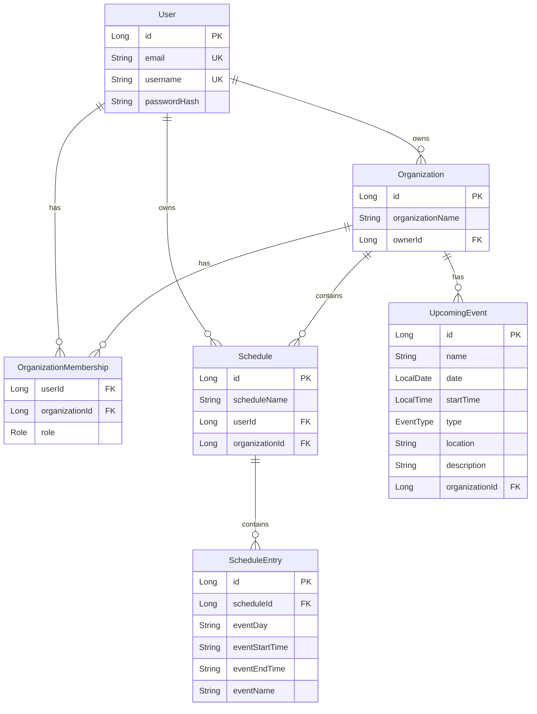
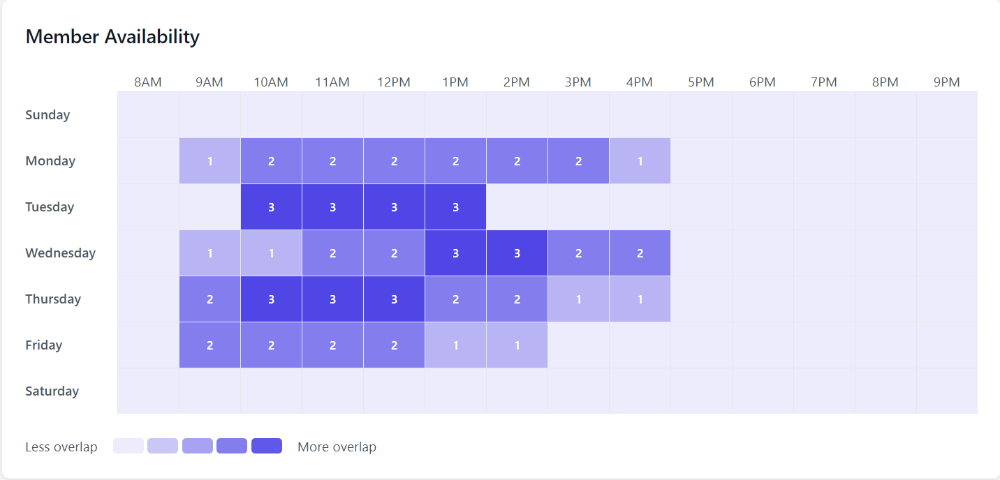
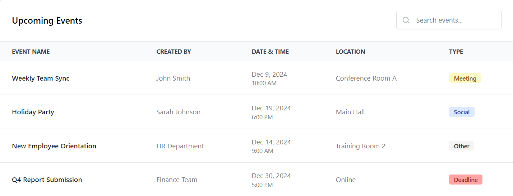
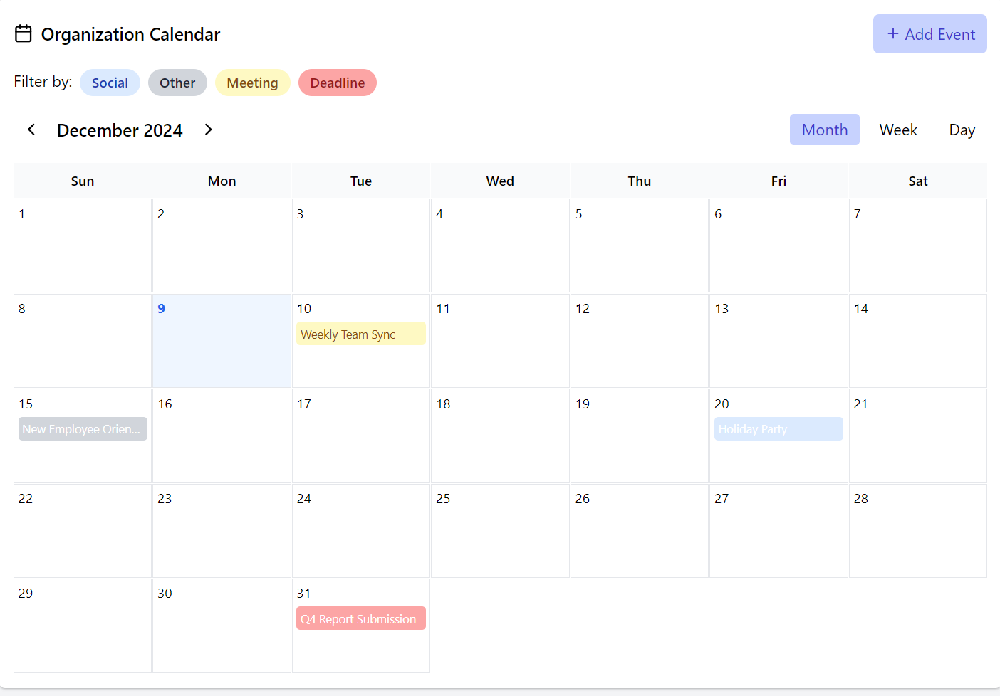

# Planly

Planly is a sophisticated web application engineered to streamline schedule coordination and event management within organizations. The platform serves as a centralized hub where organization members can share their availability, plan events, and manage group activities efficiently. With features like availability visualization and real-time schedule management, Planly simplifies the complexity of group coordination.

### Key Features
- Interactive visuals for easy event planning
- Real-time event management and coordination
- Organization-wide calendar integration
- Role-based access control and member management
- Secure authentication and data protection
- Intuitive, responsive user interface built with React
- Robust backend architecture using Spring Boot

## Personal Note:
What began as a practical solution to address scheduling challenges within my fraternity transformed into an invaluable learning experience in modern web application development. This project embodies the journey from identifying a real-world problem to implementing a comprehensive technical solution.
The evolution of Planly from a simple coordination tool to a full-featured platform reflects both my growth as a developer and my understanding of organizational dynamics.

This project stands as a testament to how personal challenges can inspire technical solutions that benefit broader communities. What started as a way to solve our fraternity's disorganization has grown into a robust platform that could help any organization better manage their collective time and activities.

*Transforming group chaos into coordinated harmony, one schedule at a time.*

## 🔧 Technical Implementation

### Backend Architecture
- **Framework**: Spring Boot with Java 21
- **API Design**: RESTful architecture with standardized endpoints
- **Security**: 
  - JWT-based authentication
  - Role-based access control (RBAC)
  - Spring Security integration
  - Password encryption using BCrypt
- **Database**: 
  - H2 Database for development
  - JPA/Hibernate for ORM
  - Structured entity relationships
  - Optimized queries for performance
#### Database Structure:


### Frontend Architecture
- **Framework**: React with modern hooks and functional components
- **State Management**: React hooks for local state management
- **UI Components**:
  - Custom modals for user interactions
  - Responsive sidebar navigation
  - Dynamic form handling
  - Toast notifications system
- **Styling**: 
  - Tailwind CSS for utility-first styling
  - Responsive design patterns
  - Lucide icons for consistent iconography

### API Endpoints

#### Authentication
- POST `/api/auth/sessions`: User login with JWT token response
- POST `/api/auth/users`: New user registration

#### Organizations
- POST `/api/organizations/new`: Create new organization
- POST `/api/organizations/{orgId}/members`: Join an organization
- POST `/api/organizations/{orgId}/events`: Add a new event to an organization
- DELETE `/api/organizations/{orgId}/members`: Remove organization member
- GET `/api/organizations/owned/id-name`: Get IDs and names of owned organizations
- GET `/api/organizations/{orgName}`: Search for organizations by name
- GET `/api/organizations/{orgId}/events`: Get upcoming events
- GET `/api/organizations/{orgId}/details`: Get organization details
- GET `/api/organizations/{orgId}/members`: Get organization members

#### Schedules
- POST `/api/schedules`: Create new schedule
- PUT `/api/schedules/{scheduleId}`: Update existing schedule
- GET `/api/schedules/entries/me`: Get current user schedule entries
- GET `/api/schedules/entries/organization/{orgId}`: Get organization member schedules

#### Users
- GET `api/users/me/first-name`: Get first name of the current user
- GET `api/users/me/organizations`: Get organizations the current user is a member of


## 🌟 Core Features

### Organization Management
- Create and manage organizations with role-based permissions
- Join existing organizations through invitation or search
- View organization member directories and manage memberships
- Organization-specific dashboards with activity overview
- Member availability heatmap showing overlapping free times



### Event Management
- Create and manage organization events with detailed information
- Event calendar with different view options
- Event categorization and type management
- Upcoming events dashboard for quick overview
<p>

</p>
<p>

</p>

### Schedule Management
- Create and edit personal schedules with customizable time slots
- Visual schedule comparison across organization members
- Schedule entries exportable for external use *(Coming soon)*


### User Experience
- Responsive design supporting desktop and mobile views
- Real-time notifications and toasts for user feedback
- Intuitive navigation with sidebar menu
- Dark/light theme support *(Coming soon)*


### Security Features
- CORS configuration for secure cross-origin requests
- CSRF protection
- Secure password handling
- JWT token validation and refresh
- Session management
- Protected API endpoints

## 🚧 Getting Started
***Note:** This project is currently in development (many security vulnerabilities have not yet been addressed). Please follow the instructions below only if you are interested in building on it or trying out the existing features.*

### Prerequisites
- Java JDK 21
- Maven
- Node.js and npm
- Git

### Installation Steps
1. Clone the Repository
```bash
git clone https://github.com/andkob/Planly.git
cd Planly
```
2. Configure JWT Secret
*This is a temporary solution for development only*
* If you're on Linux or macOS, you can generate a random secret key with the following command:
    ```bash
    $ openssl rand -base64 32
    ```
    Or if you're on Windows, you can use the provided powershell script located in the root directory:
    ```bash
    $ powershell -File jwt-secret-generator.ps1
    ```
* Copy the generated secret and hardcode it into the **application.properties** file (located in resources)
```properties
jwt.secret=YourSuperSecretKeyThatIsHardToGuess
```
3. Build and Run Backend
```bash
mvn clean install
mvn spring-boot:run
```
4. Install and Run the React Development Server
```bash
cd src/main/webapp/frontend
npm install
npm start
```
5. Access the application at http://localhost:3000

## 🔜 Upcoming Features
- Google OAuth 2.0 integration
- Google Calendar synchronization
- Real-time chat functionality
- Enhanced event management tools
- Mobile application

## License
This software is proprietary and under a custom restrictive license. While the code is publicly visible and contributions are welcome, the software may not be run, deployed, or used without explicit permission from the copyright holder.

See the [LICENSE](./LICENSE) file for full terms.

Copyright (c) 2024 Andrew J Kobus - All Rights Reserved