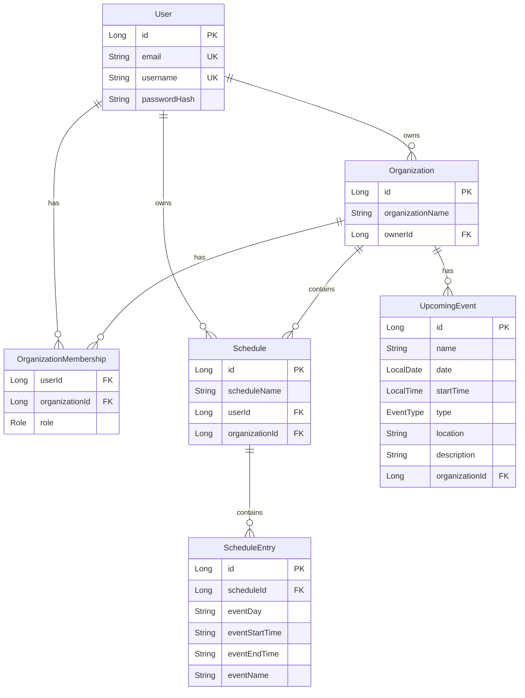

```mermaid
erDiagram
    User ||--o{ Organization : "owns"
    User ||--o{ OrganizationMembership : "has"
    User ||--o{ Schedule : "owns"
    
    Organization ||--o{ OrganizationMembership : "has"
    Organization ||--o{ Schedule : "contains"
    Organization ||--o{ UpcomingEvent : "has"
    
    Schedule ||--o{ ScheduleEntry : "contains"
    
    OrganizationMembership {
        Long userId FK
        Long organizationId FK
        Role role
    }
    
    User {
        Long id PK
        String email UK
        String username UK
        String passwordHash
    }
    
    Organization {
        Long id PK
        String organizationName
        Long ownerId FK
    }
    
    Schedule {
        Long id PK
        String scheduleName
        Long userId FK
        Long organizationId FK
    }
    
    ScheduleEntry {
        Long id PK
        Long scheduleId FK
        String eventDay
        String eventStartTime
        String eventEndTime
        String eventName
    }
    
    UpcomingEvent {
        Long id PK
        String name
        LocalDate date
        LocalTime startTime
        EventType type
        String location
        String description
        Long organizationId FK
    }
```